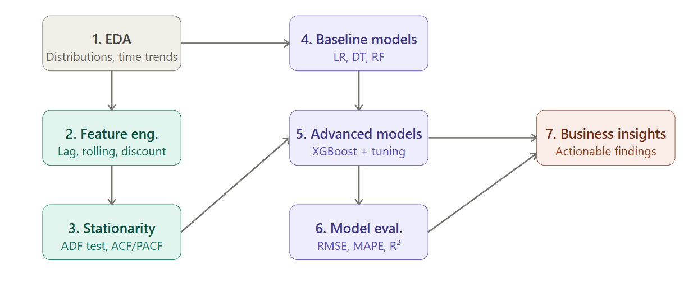
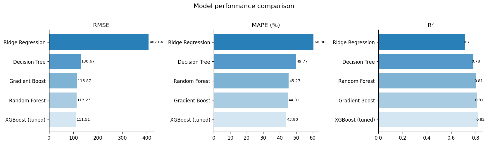

# 🍽️ Food Demand Forecasting — Multi-Model ML Pipeline

>🚀 Achieved 43.9% MAPE using XGBoost on 456K+ data points for weekly food demand forecasting across fulfillment centers.


---

## Problem Statement

Food delivery platforms must forecast demand at the center-meal level to make real-time decisions on inventory stocking, delivery partner allocation, and promotional spend. Inaccurate forecasts lead to either stockouts (lost revenue, poor customer experience) or overstock (food waste, margin erosion).

This project builds an end-to-end demand forecasting pipeline on a real-world dataset of **456,548 weekly observations** across **77 fulfillment centers and 51 meal SKUs**, using the kind of lag-based and rolling-window feature engineering that powers production forecasting systems.

---

## Dataset

**Source:** [Food Demand Forecasting — Kaggle](https://www.kaggle.com/datasets/kannanaikkal/food-demand-forecasting)

| File | Description |
|---|---|
| `train.csv` | Weekly orders per center-meal pair (145 weeks) |
| `meal_info.csv` | Meal category and cuisine type |
| `fulfilment_center_info.csv` | Center type, city, region, operational area |

**Target variable:** `num_orders` — weekly order count per center-meal pair

---

## Project Structure

```
food-demand-forecasting/
├── food_demand_forecasting.ipynb   ← Main analysis notebook (23 cells)
├── train.csv                       ← Raw training data
├── meal_info.csv                   ← Meal metadata
├── fulfilment_center_info.csv      ← Center metadata
├── requirements.txt
└── README.md
```

---
## Architecture Diagram

> High-level system design used in a production-style demand forecasting pipeline


---

## Methodology

### 1. Exploratory Data Analysis
- Distribution analysis of `num_orders` — identified right skew (log-transform applied)
- Temporal demand trend with ±1 std confidence band across 145 weeks
- Category and cuisine breakdowns via boxplots
- Full feature correlation heatmap

### 2. Statistical Hypothesis Testing
Rigorously tested whether promotional channels drive statistically significant order lift:
| Channel | Mean orders (active) | Mean orders (inactive) | Lift | p-value | Verdict |
|---|---|---|---|---|---|
| Email promotion | 623.76 | 226.24 | ~2.75x | < 0.05 | ✅ Significant |
| Homepage feature | 636.06 | 236.35 | ~2.69x | < 0.05 | ✅ Significant |

Test used: **Mann-Whitney U** (non-parametric, appropriate for skewed order distributions)

### 3. Price Elasticity Analysis
Binned discount percentage into 5 buckets and measured mean demand response — confirming price-elastic demand curves consistent with promotional pricing theory.

### 4. Time Series Analysis
- **ADF (Augmented Dickey-Fuller) test** to check stationarity
- **ACF / PACF plots** to identify autocorrelation structure and guide lag selection
- These tests motivated the use of lag features rather than treating observations as i.i.d.

### 5. Feature Engineering
Key features engineered from raw data:

| Feature | Type | Rationale |
|---|---|---|
| `lag_1`, `lag_2`, `lag_4` | Temporal | Previous-week demand is the strongest predictor |
| `rolling_mean_4` | Temporal | Captures 4-week demand momentum |
| `rolling_std_4` | Temporal | Captures demand volatility |
| `rolling_max_4` | Temporal | Captures recent demand ceiling |
| `discount_pct` | Price | Measures actual price reduction |
| `price_ratio` | Price | Normalized price signal |
| `promo_discount` | Interaction | Email promo × discount synergy |
| `hp_discount` | Interaction | Homepage × discount synergy |

**Time-aware split:** Last 10 weeks held out as test set — mimics real deployment where you predict future weeks unseen during training.

### 6. Modeling Approach

| Model | Notes |
|---|---|
| Ridge Regression | Linear baseline with L2 regularization |
| Decision Tree | Non-linear, interpretable |
| Random Forest | Ensemble, 100 estimators |
| Gradient Boosting | Sequential ensemble, `lr=0.05` |
| **XGBoost (tuned)** | GridSearchCV over 5 hyperparameters, 3-fold CV |

### 7. Evaluation Metrics

- **RMSE** — penalizes large errors (critical for capacity planning)
- **MAPE** — scale-independent, industry standard for demand forecasting
- **R²** — explained variance in log-order space
- **Residual analysis** — distribution, actual vs predicted, heteroscedasticity check
- **Shapiro-Wilk test** on residuals

---

## Key Results

| Model | RMSE | MAPE (%) | R² |
|---|---|---|---|
| Ridge Regression | 407.8 | 60.3%  | 0.7148 |
| Decision Tree | 130.7 | 49.77% | 0.7812 |
| Random Forest | 113.2 | 45.27% | 0.8058 |
| Gradient Boosting | 115.9 | 44.81% | 0.8111 |
| **XGBoost (tuned)** | **111.5** |  **43.90%** | **0.8197** |

>XGBoost outperformed due to its ability to capture non-linear temporal + pricing interactions


**Top features by importance (XGBoost):**
1. `lag_1` — last-week demand dominates all other signals
2. `rolling_mean_4` — 4-week momentum
3. `discount_pct` — price elasticity confirmed by model
4. `emailer_for_promotion` — statistically and predictively significant
5. `checkout_price` — absolute price level matters independently

---
## Model Performance Comparison
Visual comparison of all models across RMSE, MAPE, and R².

---


## Business Insights

1. **Lag-1 demand is the most reliable inventory signal.** Fulfillment centers should use last-week order volume as the primary input for next-week staffing and stocking decisions.

2. **Email promotions drive ~2.75x order lift** with statistical significance (p < 0.05). For underperforming centers, targeted email campaigns are the highest-ROI lever.

3. **Homepage featuring produces ~2.69x lift** — larger than email alone. Combined email + homepage promotions should be reserved for high-margin meals where the volume uplift justifies the channel cost.

4. **Price elasticity is nonlinear.** Discounts above 20% produce diminishing returns in order volume — suggesting a sweet spot for promotional pricing between 10–20%.

5. **Top 10 centers account for disproportionate order volume.** Demand sensing accuracy for these centers has outsized impact on overall platform efficiency.

---

## Setup & Reproduction

```bash
# Clone the repo
git clone https://github.com/Sainishitha11/food-demand-forecasting.git
cd food-demand-forecasting

# Install dependencies
pip install -r requirements.txt

# Download dataset from Kaggle
kaggle datasets download -d kannanaikkal/food-demand-forecasting
unzip food-demand-forecasting.zip

# Launch notebook
jupyter notebook food_demand_forecasting.ipynb
```

---

## Tech Stack

`Python` · `Pandas` · `NumPy` · `Scikit-learn` · `XGBoost` · `Statsmodels` · `SciPy` · `Matplotlib` · `Seaborn`

---

## Author

**Kamma Sainishitha**  
B.Tech AI & Data Science, IIIT Kottayam (2023–2027) 
[GitHub](https://github.com/Sainishitha11) · [Email](mailto:kamma23bcd31@iiitkottayam.ac.in)
